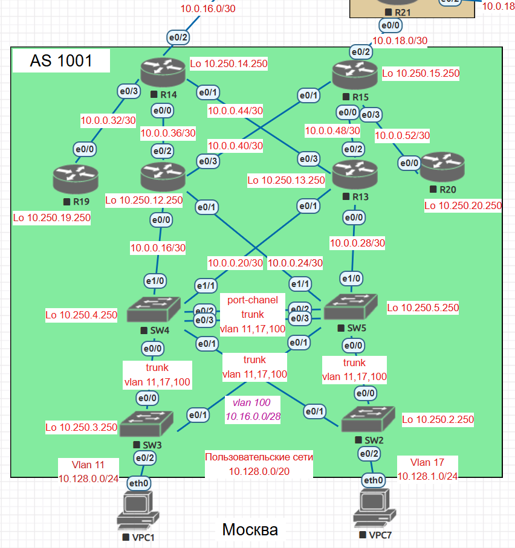

# Домашнее задание
## Проектирование сети

### Цель:
### распланировать адресное пространство, настроить IP на активных портах для дальнейшей работы над проектом и задокументировать адресацию.

Описание/Пошаговая инструкция выполнения домашнего задания:      
В этой самостоятельной работе мы ожидаем, что вы самостоятельно:     

1. Разработаете и задокументируете адресное пространство для лабораторного стенда.     
2. Настроите ip адреса на каждом активном порту      
3. Настроите каждый VPC в каждом офисе в своем VLAN.     
4. Настроите VLAN/Loopback up interface управления для сетевых устройств     
5. Настроите сети офисов так, чтобы не возникало broadcast штормов, а использование линков было максимально оптимизировано      
6. Используете IPv4. IPv6 по желанию

### 1. Адресное пространство.      
Для всей сети предприятия выберем частную сеть класса А - 10.0.0.0 255.0.0.0.      
Из этого диапазона сетей 10.128.0.0 255.255.0.0 выделяется под сети хостов, 10.0.0.0 255.255.0.0 транзитные сети, 10.250.0.0 255.255.0.0 сети под Loopback интерфейсы.   

| Сеть     | Назначение | 
|----------|-----------|                                   
| 10.0.0.0/16 | Транзитные сети |    
| 10.128.0.0/16 | Сети хостов |
| 10.250.0.0/16 | Loopback |        

### Транзитные сети     

| Область  | Сеть транзитная |
|-----------|-------------|
|  Москва   | 10.0.0.0/23 |      
| С-Петербург | 10.0.2.0/23 |     
| Чокурдах | 10.0.4.0/23 |     
| Киторн   | 10.0.16.0/23 |
| Ламас    | 10.0.18.0/23 |
| Триада   | 10.0.20.0/23 |
| Лабытнанги | ---------- |

### Сети для VPC       
| Наименование VPC | Vlan | Сеть | Шлюз | Ip address хоста | Регион  | Диапазон сетей региона |
|-------------------|-------|-------|-------|--------------|---------|------------------------|             
| VPC1              | 11    | 10.128.0.0/24 | 10.128.0.1 | 10.128.0.11 | Москва  | 10.128.0.0/20 |
| VPC7              | 17    | 10.128.1.0/24 | 10.128.1.1 | 10.128.1.17 | Москва | 10.128.0.0/20 |      
| VPC8              | 8     | 10.128.16.0/24 | 10.128.16.1 | 10.128.16.8 | С-Петербург | 10.128.16.0/20 |
| VPC               | 10    | 10.128.17.0/24 | 10.128.17.1 | 10.128.17.10 | С-Петербург | 10.128.16.0/20 |
| VPC30             | 30    | 10.128.32.0/24 | 10.128.32.1 | 10.128.32.30 | Чокурдах | 10.128.32.0/20 |
| VPC31             | 31    | 10.128.33.0/24 | 10.128.33.1 | 10.128.33.31 | Чокурдах | 10.128.32.0/20 |            

### Регион Москва транзитные сети            

| Устройство | Loopback        |   E0/0           |   E0/1          |     E0/2 |      E0/3 |      E1/0 |     E1/1 | MGMT              |
|------------|-----------------|------------------|-----------------|----------|-----------|-----------|----------|-------------------|    
| SW2        | 10.250.2.250/32 | Trunk 11,17,100  | Trunk 11,17,100 | Vlan 17  |           |           |          | Vlan100 10.0.0.2/28 |  
| SW3        | 10.250.3.250/32 | Trunk 11,17,100  | Trunk 11,17,100 | Vlan 11  |           |           |          | Vlan100 10.0.0.3/28 |
| SW4        | 10.250.4.250/32 | Trunk 11,17,100  | Trunk 11,17,100 | Po1, Trunk 11,17,100 | Po1, Trunk 11,17,100 | Vlan 101 10.0.0.17/30 | Vlan 102 10.0.0.21/30 | Vlan100 10.0.0.4/28 |
| SW5        | 10.250.5.250/32 | Trunk 11,17,100  | Trunk 11,17,100 | Po1, Trunk 11,17,100 | Po1, Trunk 11,17,100 | Vlan 103 10.0.0.29/30 | Vlan 104 10.0.0.25/30 | Vlan100 10.0.0.5/28 |
| R12        | 10.250.12.250/32 | 10.0.0.18/30  | 10.0.0.26/30 | 10.0.0.37/30 | 10.0.0.41/30 |  |  |  |
| R13        | 10.250.13.250/32 | 10.0.0.30/30  | 10.0.0.22/30 | 10.0.0.49/30 | 10.0.0.45/30 |  |  |  |
| R14        | 10.250.14.250/32 | 10.0.0.38/30  | 10.0.0.46/30 | 10.0.16.1/30 | 10.0.0.34/30 |  |  |  |
| R15        | 10.250.15.250/32 | 10.0.0.50/30  | 10.0.0.42/30 | 10.0.18.1/30 | 10.0.0.54/30 |  |  |  |
| R19        | 10.250.19.250/32 | 10.0.0.33/30  |  |  |  |  |  |  |
| R20        | 10.250.20.250/32 | 10.0.0.53/30  |  |  |  |  |  |  |    

### Москва    

### Регион С-Петербург транзитные сети

| Устройство | Loopback        |   E0/0           |   E0/1          |     E0/2 |      E0/3 |      E1/0 |     E1/1 | MGMT              |
|------------|-----------------|------------------|-----------------|----------|-----------|-----------|----------|-------------------|    
| SW9        | 10.250.9.250/32 | Po1, Trunk 8,10,100 | Po1, Trunk 8,10,100 | Vlan 8   | 10.0.2.1/30 | 10.0.2.5/30 |          |  | 
| SW10       | 10.250.10.250/32 | Po1, Trunk 8,10,100 | Po1, Trunk 8,10,100 | Vlan 10 | 10.0.2.9/30 | 10.0.2.13/30 |          |  |      
| R16        | 10.250.16.250/32 | 10.0.2.10/30 | 10.0.2.17/30 | 10.0.2.6/30 | 10.0.2.22/30 |  |  |  |      

