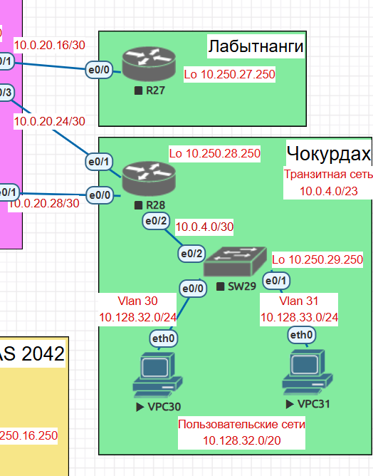

# Лабораторная работа 2

### Описание/Пошаговая инструкция выполнения домашнего задания:
В этой самостоятельной работе мы ожидаем, что вы самостоятельно:              

1. Настроите политику маршрутизации для сетей офиса.            
2. Распределите трафик между двумя линками с провайдером.              
3. Настроите отслеживание линка через технологию IP SLA.(только для IPv4)                 
4. Настройте для офиса Лабытнанги маршрут по-умолчанию.                
5. План работы и изменения зафиксированы в документации .                 

### 1. За пример возьмем офис Чокурдах            

           

В офисе Чокурдах есть только один пограничный маршрутизатор R28 отвечающий за подключение к двум ISP R25 и R26.            
Допустим R25 основной провайдер
Тогда на R28 завернем на R25 весь трафик командой                
ip route 0.0.0.0 0.0.0.0 10.0.20.25 1          
Резервный маршрут пропишем в сторону R26
ip route 0.0.0.0 0.0.0.0 10.0.20.29 1              
Таблица маршрутизации после этого будет выглядеть таким образом:          
R28#show ip route            
Gateway of last resort is 10.0.20.29 to network 0.0.0.0                  

S*    0.0.0.0/0 [1/0] via 10.0.20.29          
                [1/0] via 10.0.20.25 /* Вариант c ecmp, трафик распределяется между двумя провайдерами. Хороший вариант только с Nat, иначе возможен вариант когда трафик исходящий идет через один интерфейс, входящий через другой.                   
      10.0.0.0/8 is variably subnetted, 8 subnets, 3 masks                    
C        10.0.4.0/30 is directly connected, Ethernet0/2                     
L        10.0.4.2/32 is directly connected, Ethernet0/2                
C        10.0.20.24/30 is directly connected, Ethernet0/1              
L        10.0.20.26/32 is directly connected, Ethernet0/1            
C        10.0.20.28/30 is directly connected, Ethernet0/0              
L        10.0.20.30/32 is directly connected, Ethernet0/0                 
S        10.128.32.0/23 [1/0] via 10.0.4.1                
C        10.250.28.250/32 is directly connected, Loopback0                      
                                
Возьмем вариант два. С применение PBR.            
На R28 пропишем два маршрута с разными метриками.                                
ip route 0.0.0.0 0.0.0.0 10.0.20.25               
ip route 0.0.0.0 0.0.0.0 10.0.20.29 100  
Результат:             
R28#show ip route
Gateway of last resort is 10.0.20.25 to network 0.0.0.0                

S*    0.0.0.0/0 [1/0] via 10.0.20.25                   
      10.0.0.0/8 is variably subnetted, 8 subnets, 3 masks               
C        10.0.4.0/30 is directly connected, Ethernet0/2               
L        10.0.4.2/32 is directly connected, Ethernet0/2               
C        10.0.20.24/30 is directly connected, Ethernet0/1             
L        10.0.20.26/32 is directly connected, Ethernet0/1                  
C        10.0.20.28/30 is directly connected, Ethernet0/0                             
L        10.0.20.30/32 is directly connected, Ethernet0/0            
S        10.128.32.0/23 [1/0] via 10.0.4.1                    
C        10.250.28.250/32 is directly connected, Loopback0                     

#### Допустим есть сервис в интернет (8.8.8.8) к которому хотят получить доступ оба наших пользователя 10.128.32.0/24 и 10.128.33.0/24.             
По умолчанию весь трафик пойдет через R25. Напишем PBR исходя из которого сеть 10.128.33.0/24 идет к ресурсу 8.8.8.8 через второго интернет провайдера R26.           
#### R28                 
ip access-list extended PBR_VPC_Google                
 permit ip 10.128.33.0 0.0.0.255 host 8.8.8.8               
!                 
!               
route-map PBR_VPC_GOOGLE permit 20               
 match ip address PBR_VPC_Google                 
 set ip next-hop 10.0.20.29             
У R28 один интерфейс к домашним сетям E0/2. Вешаем на E0/2.                   
!               
interface Ethernet0/2         
 ip address 10.0.2.18 255.255.255.252           
 ip policy route-map PBR_VPC_GOOGLE          
!                              
После таких настроек трафик от VPC к 8.8.8.8 пойдет через 10.0.20.29.         
                
### 3. Настроите отслеживание линка через технологию IP SLA.(только для IPv4)           
На R28 для примера настроим на интерфейсах E0/0 и E0/1            
!            
ip sla 10                  
 icmp-echo 10.0.20.25 source-ip 10.0.20.26                     
 frequency 5                       
ip sla schedule 10 life forever start-time now               
!            
track 10 ip sla 10 reachability
ip route 0.0.0.0 0.0.0.0 10.0.20.25 track 10

### Проверка IP SLA              
#### Если уронить интерфейс e0/3 на R25
R28#show ip route         
Gateway of last resort is 10.0.20.29 to network 0.0.0.0           
                 
S*    0.0.0.0/0 [100/0] via 10.0.20.29                
      10.0.0.0/8 is variably subnetted, 8 subnets, 3 masks           
C        10.0.4.0/30 is directly connected, Ethernet0/2             
L        10.0.4.2/32 is directly connected, Ethernet0/2             
C        10.0.20.24/30 is directly connected, Ethernet0/1             
L        10.0.20.26/32 is directly connected, Ethernet0/1               
C        10.0.20.28/30 is directly connected, Ethernet0/0              
L        10.0.20.30/32 is directly connected, Ethernet0/0               
S        10.128.32.0/23 [1/0] via 10.0.4.1                 
C        10.250.28.250/32 is directly connected, Loopback0                    
R28#                   
#### если поднять интерфейс E0/3 на R25      
*Sep 23 13:56:30.415: %TRACK-6-STATE: 10 ip sla 10 reachability Down -> Up
R28#show ip route
Codes: L - local, C - connected, S - static, R - RIP, M - mobile, B - BGP
       D - EIGRP, EX - EIGRP external, O - OSPF, IA - OSPF inter area
       N1 - OSPF NSSA external type 1, N2 - OSPF NSSA external type 2
       E1 - OSPF external type 1, E2 - OSPF external type 2
       i - IS-IS, su - IS-IS summary, L1 - IS-IS level-1, L2 - IS-IS level-2
       ia - IS-IS inter area, * - candidate default, U - per-user static route
       o - ODR, P - periodic downloaded static route, H - NHRP, l - LISP
       a - application route
       + - replicated route, % - next hop override

Gateway of last resort is 10.0.20.25 to network 0.0.0.0

S*    0.0.0.0/0 [1/0] via 10.0.20.25
      10.0.0.0/8 is variably subnetted, 8 subnets, 3 masks
C        10.0.4.0/30 is directly connected, Ethernet0/2
L        10.0.4.2/32 is directly connected, Ethernet0/2
C        10.0.20.24/30 is directly connected, Ethernet0/1
L        10.0.20.26/32 is directly connected, Ethernet0/1
C        10.0.20.28/30 is directly connected, Ethernet0/0
L        10.0.20.30/32 is directly connected, Ethernet0/0
S        10.128.32.0/23 [1/0] via 10.0.4.1
C        10.250.28.250/32 is directly connected, Loopback0
R28#

### А теперь сделаем схему по которой каналы будут переключаться автоматически.
### R28
track 10 ip sla 10 reachability                
!               
track 20 ip sla 20 reachability              
               
ip route 0.0.0.0 0.0.0.0 10.0.20.25 track 10              
ip route 0.0.0.0 0.0.0.0 10.0.20.29 100 track 20              
                  
ip access-list extended PBR_VPC_Google              
 permit ip 10.128.33.0 0.0.0.255 host 8.8.8.8            
ip access-list extended PBR_VPC_Google_2             
 permit ip any host 8.8.4.4               
!             
ip sla 10  /*проверка канала до R25              
 icmp-echo 10.0.20.25 source-ip 10.0.20.26                
 frequency 5               
ip sla schedule 10 life forever start-time now               
ip sla 20 /* проверка канала до R26               
 icmp-echo 10.0.20.29 source-ip 10.0.20.30              
 frequency 5                
ip sla schedule 20 life forever start-time now             
!               
route-map PBR_VPC_GOOGLE permit 20            
 match ip address PBR_VPC_Google              
 set ip next-hop verify-availability 10.0.20.29 20 track 20 /* проверка канала до R26, если не работает то маршрут из таблицы маршрутизации               
!             
route-map PBR_VPC_GOOGLE permit 30             
 match ip address PBR_VPC_Google_2            
 set ip next-hop verify-availability 10.0.20.25 10 track 10 /* проверка канала до R25, если не работает то маршрут из таблицы маршрутизации              

### Каналы переключаются 
