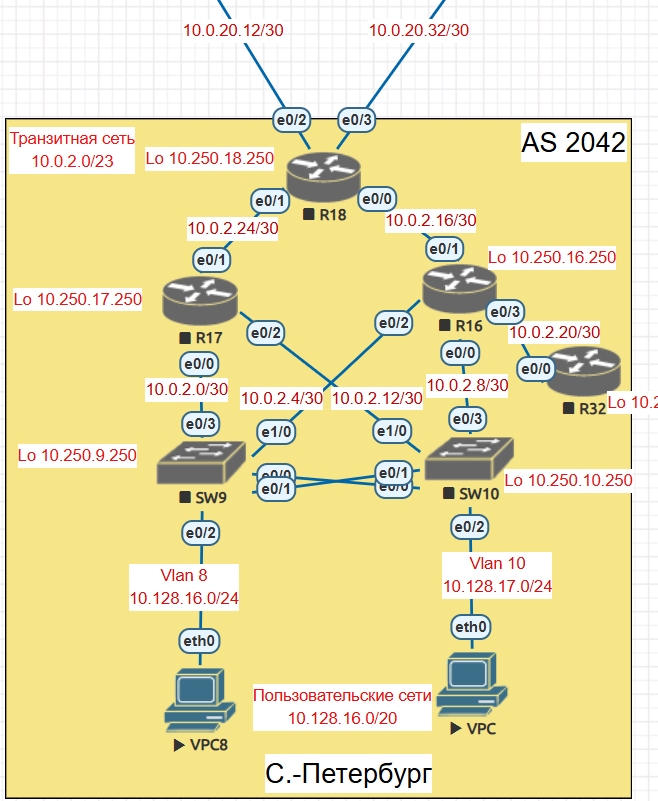

# Лабораторная работа 2

### Описание/Пошаговая инструкция выполнения домашнего задания:
В этой самостоятельной работе мы ожидаем, что вы самостоятельно:              

1. Настроите политику маршрутизации для сетей офиса.            
2. Распределите трафик между двумя линками с провайдером.              
3. Настроите отслеживание линка через технологию IP SLA.(только для IPv4)                 
4. Настройте для офиса Лабытнанги маршрут по-умолчанию.                
5. План работы и изменения зафиксированы в документации .                 

### 1. За пример возьмем офис С-Петербург             

           

В офисе С-Петербург есть только один пограничный маршрутизатор R18 отвечающий за подключение к двум ISP R24 и R26.            
Допустим R24 основной провайдер
Тогда на R18 завернем на R24 весь трафик командой                
ip route 0.0.0.0 0.0.0.0 10.0.20.14           
Резервный маршрут пропишем в сторону R26
ip route 0.0.0.0 0.0.0.0 10.0.20.34 200
Таблица маршрутизации после этого будет выглядеть таким образом:         
R18#show ip route            
Gateway of last resort is 10.0.20.14 to network 0.0.0.0                  

S*    0.0.0.0/0 [1/0] via 10.0.20.14   /* в таблице маршрутизации только один маршрут виден                
      10.0.0.0/8 is variably subnetted, 9 subnets, 2 masks                
C        10.0.2.16/30 is directly connected, Ethernet0/0              
L        10.0.2.18/32 is directly connected, Ethernet0/0                
C        10.0.2.24/30 is directly connected, Ethernet0/1               
L        10.0.2.26/32 is directly connected, Ethernet0/1              
C        10.0.20.12/30 is directly connected, Ethernet0/2                
L        10.0.20.13/32 is directly connected, Ethernet0/2                
C        10.0.20.32/30 is directly connected, Ethernet0/3               
L        10.0.20.33/32 is directly connected, Ethernet0/3                   
C        10.250.18.250/32 is directly connected, Loopback0                     
                    

### 4. Настройте для офиса Лабытнанги маршрут по-умолчанию.      
               
Офис Лабытнанги имеет только один выход в интернет, поэтому на R27 прописываем команду     
#### ip route 0.0.0.0 0.0.0.0 10.0.20.17

##### Таблица маршрутизации после этого выглядит следующим образом:       
S*    0.0.0.0/0 [1/0] via 10.0.20.17           
      10.0.0.0/8 is variably subnetted, 3 subnets, 2 masks                       
C        10.0.20.16/30 is directly connected, Ethernet0/0               
L        10.0.20.18/32 is directly connected, Ethernet0/0               
C        10.250.27.250/32 is directly connected, Loopback0                    
            
