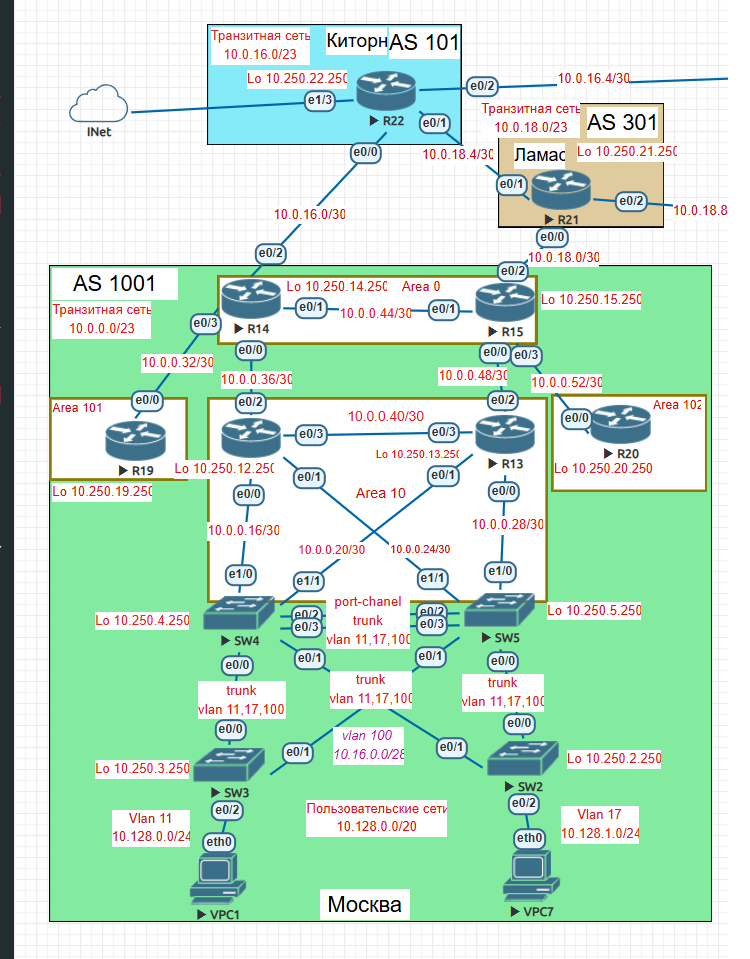

# Лабораторная работа №3           

1. Маршрутизаторы R14-R15 находятся в зоне 0 - backbone.           
2. Маршрутизаторы R12-R13 находятся в зоне 10. Дополнительно к маршрутам должны получать маршрут по умолчанию.            
3. Маршрутизатор R19 находится в зоне 101 и получает только маршрут по умолчанию.            
4. Маршрутизатор R20 находится в зоне 102 и получает все маршруты, кроме маршрутов до сетей зоны 101.                       

## 1. Маршрутизаторы R14-R15 находятся в зоне 0 - backbone.    
Маршрутизаторы R14-R15 являются ABR, то есть часть интерфейсов находятся в других зонах.       

         
| Маршрутизатор    | E0/0 | E0/1 | E0/2 | E0/3 | Loopback 0 |              
|------------------|------|------|------|------|------------|             
| R14 | area 10 | area 0 | area 0 | area 101 | area 0 |             
| R15 | area 10 | area 0 | area 0 | area 102 | area 0 |                        

                           
Настройки на R14                         
                    
### Пример конфигурации R14           
/ ****** R14 *********/                
router ospf 10 /* включаем процесс */                                   
 router-id 10.250.14.250                    
 passive-interface default /* по умолчанию все интерфейсы в пассив режиме, не ищут соседей */               
 no passive-interface Ethernet0/0 /* поиск соседей на интерфейсе e0/0 */                         
 no passive-interface Ethernet0/1           
 no passive-interface Ethernet0/3                   
 !         
interface Loopback0             
 ip address 10.250.14.250 255.255.255.255                  
 ip ospf 10 area 0            
!
interface Ethernet0/0          
 description to_R12         
 ip address 10.0.0.38 255.255.255.252          
 ip ospf 10 area 10           
!             
interface Ethernet0/1            
 description to_R15             
 ip address 10.0.0.45 255.255.255.252           
 ip ospf 10 area 0           
!            
interface Ethernet0/2           
 description to_R22              
 ip address 10.0.16.1 255.255.255.252           
 ip ospf 10 area 0            
!              
interface Ethernet0/3           
 description to_R19          
 ip address 10.0.0.34 255.255.255.252             
 ip ospf 10 area 101           
!                      
/ ********* end R14 ************/                  

## 2. Маршрутизаторы R12-R13 находятся в зоне 10. Дополнительно к маршрутам должны получать маршрут по умолчанию.         

Маршрутизаторы R12-R13, а также коммутаторы SW4, SW5 находятся в зоне 10. Тип normal. R14, R15 должны передавать маршрут по умолчанию.         

Все устройства R12, R13, SW4, SW5 полностью в зоне 10, ABR для зоны 10 R14,R15.
Пример настройки R12          
/ **************** R12 ************** /
                    
interface Loopback0                 
 ip address 10.250.12.250 255.255.255.255              
 ip ospf 10 area 10            
!                
interface Ethernet0/0             
 description to_SW4                
 ip address 10.0.0.18 255.255.255.252               
 ip ospf 10 area 10              
!                 
interface Ethernet0/1                
 description to_SW5               
 ip address 10.0.0.26 255.255.255.252           
 ip ospf 10 area 10           
!              
interface Ethernet0/2          
 description to_R14             
 ip address 10.0.0.37 255.255.255.252           
 ip ospf 10 area 10           
!              
interface Ethernet0/3         
 description to_R13            
 ip address 10.0.0.41 255.255.255.252            
 ip ospf 10 area 10             
 !           
 router ospf 10           
 router-id 10.250.12.250            
 passive-interface default          
 no passive-interface Ethernet0/0         
 no passive-interface Ethernet0/1           
 no passive-interface Ethernet0/2            
 no passive-interface Ethernet0/3          
!            
/ *********** end R12 *************** /                    
       
### R14, R15 должны передавать маршрут по умолчанию.          

Настройки R14         
/ ********** R14 *********** /                 
ip route 0.0.0.0 0.0.0.0 10.0.16.2                
router ospf 10           
 default-information originate                     
!             
/ ********** R14 *********** /               
                  
Настройки R15         
/ ********** R15 *********** /                
ip route 0.0.0.0 0.0.0.0 10.0.18.2                
router ospf 10           
 default-information originate                     
!             
/ ********** R15 *********** /               

Таблица маршрутизации R12.   
/ *********** show ip route ****************** /                  
O*E2  0.0.0.0/0 [110/1] via 10.0.0.38, 02:44:37, Ethernet0/2            
      10.0.0.0/8 is variably subnetted, 27 subnets, 4 masks              
O        10.0.0.0/28 [110/11] via 10.0.0.25, 02:44:09, Ethernet0/1               
                     [110/11] via 10.0.0.17, 02:43:59, Ethernet0/0            
C        10.0.0.16/30 is directly connected, Ethernet0/0               
L        10.0.0.18/32 is directly connected, Ethernet0/0                 
O        10.0.0.20/30 [110/11] via 10.0.0.17, 02:43:59, Ethernet0/0          
C        10.0.0.24/30 is directly connected, Ethernet0/1            
L        10.0.0.26/32 is directly connected, Ethernet0/1             
O        10.0.0.28/30 [110/11] via 10.0.0.25, 02:44:09, Ethernet0/1             
O IA     10.0.0.32/30 [110/20] via 10.0.0.38, 02:44:37, Ethernet0/2            
C        10.0.0.36/30 is directly connected, Ethernet0/2              
L        10.0.0.37/32 is directly connected, Ethernet0/2              
C        10.0.0.40/30 is directly connected, Ethernet0/3              
L        10.0.0.41/32 is directly connected, Ethernet0/3            
O IA     10.0.0.44/30 [110/20] via 10.0.0.38, 02:44:37, Ethernet0/2             
O        10.0.0.48/30 [110/20] via 10.0.0.42, 02:44:47, Ethernet0/3               
O IA     10.0.0.52/30 [110/30] via 10.0.0.42, 02:03:38, Ethernet0/3              
                      [110/30] via 10.0.0.38, 02:03:38, Ethernet0/2           
O IA     10.0.16.0/30 [110/20] via 10.0.0.38, 02:44:37, Ethernet0/2            
O IA     10.0.18.0/30 [110/30] via 10.0.0.42, 02:44:47, Ethernet0/3            
                      [110/30] via 10.0.0.38, 02:44:37, Ethernet0/2           
O        10.128.0.0/24 [110/11] via 10.0.0.25, 02:44:09, Ethernet0/1           
                       [110/11] via 10.0.0.17, 02:43:59, Ethernet0/0               
O        10.128.1.0/24 [110/11] via 10.0.0.25, 02:44:09, Ethernet0/1          
                       [110/11] via 10.0.0.17, 02:43:59, Ethernet0/0             
O        10.250.4.250/32 [110/11] via 10.0.0.17, 02:43:59, Ethernet0/0               
O        10.250.5.250/32 [110/11] via 10.0.0.25, 02:44:09, Ethernet0/1              
C        10.250.12.250/32 is directly connected, Loopback0             
O        10.250.13.250/32 [110/11] via 10.0.0.42, 02:44:47, Ethernet0/3          
O IA     10.250.14.250/32 [110/11] via 10.0.0.38, 02:44:37, Ethernet0/2            
O IA     10.250.15.250/32 [110/21] via 10.0.0.42, 02:44:47, Ethernet0/3             
                          [110/21] via 10.0.0.38, 02:44:37, Ethernet0/2          
O IA     10.250.19.250/32 [110/21] via 10.0.0.38, 02:44:37, Ethernet0/2             
O IA     10.250.20.250/32 [110/31] via 10.0.0.42, 01:45:01, Ethernet0/3               
                          [110/31] via 10.0.0.38, 01:45:01, Ethernet0/2                     
                 
/ *********** end show ip route ****************** /                 

                         
## 3. Маршрутизатор R19 находится в зоне 101 и получает только маршрут по умолчанию.              

Для того, чтобы получать только маршрут по умолчанию делаем area 101 stub. В area 101 входят два роутера R19 и R14 интерфейсом e0/3 (R14 ABR)                            
Настройки R19              
/ *********** R19 *************** /                      
interface Loopback0             
 ip address 10.250.19.250 255.255.255.255           
 ip ospf 10 area 101          
!          
interface Ethernet0/0         
 description to_R14          
 ip address 10.0.0.33 255.255.255.252           
 ip ospf 10 area 101          
!         
router ospf 10         
 router-id 10.250.19.250            
 area 101 stub            
 passive-interface default           
 no passive-interface Ethernet0/0              
/ ************* end R19 ************** /               
/ ************* R14 ***************** /                 
router ospf 10           
 area 101 stub no-summary          
 default-information originate          
/ ************* end R14 ***************** /                
Таблица маршрутизации R19.   
/ *********** show ip route ****************** /                  
O*IA  0.0.0.0/0 [110/11] via 10.0.0.34, 02:20:21, Ethernet0/0            
      10.0.0.0/8 is variably subnetted, 3 subnets, 2 masks          
C        10.0.0.32/30 is directly connected, Ethernet0/0         
L        10.0.0.33/32 is directly connected, Ethernet0/0       
C        10.250.19.250/32 is directly connected, Loopback0               
/ *********** end show ip route ****************** /                 

## 4. Маршрутизатор R20 находится в зоне 102 и получает все маршруты, кроме маршрутов до сетей зоны 101.

В зоне 102 находятся два Router, R20 и R15 (e0/3 ABR). Area normal.                

/ ************ R20 ************** /                  
!              
interface Loopback0             
 ip address 10.250.20.250 255.255.255.255             
 ip ospf 10 area 102          
!         
interface Ethernet0/0            
 description to_R15                
 ip address 10.0.0.53 255.255.255.252          
 ip ospf 10 area 102           
!           
router ospf 10         
 router-id 10.250.20.250          
 passive-interface default         
 no passive-interface Ethernet0/0             
!
/ ************ end R20 ************** /                

### Получает все кроме маршрутов до сетей зоны 101.

/ ************ R15 ************** /                 
router ospf 10            
 area 102 filter-list prefix OSPF-FILTER-R20-IN in /* включаем фильтр                     
!             
ip prefix-list OSPF-FILTER-R20-IN seq 20 deny 10.0.0.32/30  /* маршрут из зоны 101                   
ip prefix-list OSPF-FILTER-R20-IN seq 30 deny 10.250.19.250/32 /* маршрут из зоны 101              
ip prefix-list OSPF-FILTER-R20-IN seq 100 permit 0.0.0.0/0 le 32 /* разрешить все остальные                         
/ ************ end R15 ************** /                

Таблица маршрутизации R20.   
/ *********** show ip route ****************** /                  
O*E2  0.0.0.0/0 [110/1] via 10.0.0.54, 01:40:18, Ethernet0/0            
      10.0.0.0/8 is variably subnetted, 22 subnets, 4 masks           
O IA     10.0.0.0/28 [110/31] via 10.0.0.54, 01:40:28, Ethernet0/0          
O IA     10.0.0.16/30 [110/31] via 10.0.0.54, 01:40:28, Ethernet0/0          
O IA     10.0.0.20/30 [110/30] via 10.0.0.54, 01:40:28, Ethernet0/0      
O IA     10.0.0.24/30 [110/31] via 10.0.0.54, 01:40:28, Ethernet0/0        
O IA     10.0.0.28/30 [110/30] via 10.0.0.54, 01:40:28, Ethernet0/0        
O IA     10.0.0.36/30 [110/40] via 10.0.0.54, 01:40:28, Ethernet0/0       
O IA     10.0.0.40/30 [110/30] via 10.0.0.54, 01:40:28, Ethernet0/0          
O IA     10.0.0.44/30 [110/20] via 10.0.0.54, 01:40:28, Ethernet0/0        
O IA     10.0.0.48/30 [110/20] via 10.0.0.54, 01:40:28, Ethernet0/0         
C        10.0.0.52/30 is directly connected, Ethernet0/0        
L        10.0.0.53/32 is directly connected, Ethernet0/0         
O IA     10.0.16.0/30 [110/30] via 10.0.0.54, 01:40:28, Ethernet0/0          
O IA     10.0.18.0/30 [110/20] via 10.0.0.54, 01:40:28, Ethernet0/0         
O IA     10.128.0.0/24 [110/31] via 10.0.0.54, 01:40:28, Ethernet0/0          
O IA     10.128.1.0/24 [110/31] via 10.0.0.54, 01:40:28, Ethernet0/0         
O IA     10.250.4.250/32 [110/31] via 10.0.0.54, 01:40:28, Ethernet0/0        
O IA     10.250.5.250/32 [110/31] via 10.0.0.54, 01:40:28, Ethernet0/0         
O IA     10.250.12.250/32 [110/31] via 10.0.0.54, 01:40:28, Ethernet0/0          
O IA     10.250.13.250/32 [110/21] via 10.0.0.54, 01:40:28, Ethernet0/0       
O IA     10.250.14.250/32 [110/21] via 10.0.0.54, 01:40:28, Ethernet0/0         
O IA     10.250.15.250/32 [110/11] via 10.0.0.54, 01:40:28, Ethernet0/0           
C        10.250.20.250/32 is directly connected, Loopback0            

Маршрутов до сетей 10.250.19.250/32, 10.0.0.32.30 нет.
 
/ *********** end show ip route ****************** /                 

### Итоговые конфигурации устройств.
[Итоговые конфигурации](./Conf/README.md)

